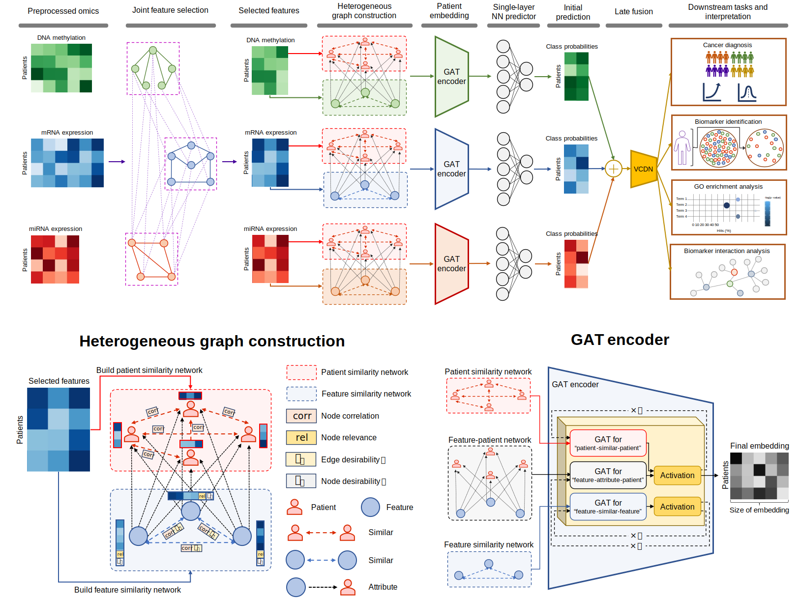

# Heterogeneous graph attention network improves cancer multiomics integration  | [Preprint](https://arxiv.org/abs/2408.02845)

<div align="left">

[](https://colab.research.google.com/github/SinaTabakhi/HeteroGATomics/blob/main/HeteroGATomics_demo.ipynb)
[](https://github.com/SinaTabakhi/HeteroGATomics/blob/main/LICENSE)
</div>

## Introduction
This repository provides the Python implementation of the **HeteroGATomics** architecture, as described in our paper titled "[Heterogeneous graph attention network improves cancer multiomics integration](https://arxiv.org/abs/2408.02845)". **HeteroGATomics** combines graph attention networks with heterogeneous graphs from multiomics data to enhance the performance of cancer diagnosis tasks. **HeteroGATomics** employs a two-stage process, integrating joint feature selection for dimensionality reduction with heterogeneous graph learning to derive omic-specific representations and unify predictions across various omic modalities.

## Architecture
The following shows an overview of the HeteroGATomics method.


## System Requirements
The source code, developed in Python 3.10, has been verified on both Linux and Windows and should be compatible with any operating system that supports Python. It is functional on standard computers and has been evaluated for both CPU and GPU usage. For optimal performance, it is recommended to execute the feature selection module on a CPU with multiprocessing support, and to train the GAT module on a GPU for faster processing.

HeteroGATomics requires the following dependencies:

```
torch>=2.1.0
torch_geometric>=2.4.0
scikit-learn>=1.3.0
pandas>=2.1.1
numpy>=1.26.0
scipy>=1.11.3
lightning>=2.1.3
xgboost>=2.0.1
```

## Installation Guide
We suggest installing HeteroGATomics through conda. Clone the GitHub repository and create a new conda virtual environment using the command provided below. The installation typically completes in about 15 minutes on a standard desktop computer.

```shell
# create a new conda virtual environment
conda create -n heterogatomics python=3.10
conda activate heterogatomics

# install required python dependencies
conda install pytorch==2.1.0 pytorch-cuda=11.8 -c pytorch -c nvidia
conda install pyg=2.4.0=*cu* -c pyg
conda install pytorch-scatter pytorch-cluster pytorch-sparse -c pyg
conda install pandas
conda install lightning -c conda-forge
conda install xgboost
conda install yacs

# clone the source code of HeteroGATomics
git clone https://github.com/SinaTabakhi/HeteroGATomics.git
cd HeteroGATomics
```

> [!NOTE]
> When installing PyTorch Geometric, scikit-learn and SciPy are automatically installed as part of the process.


## Datasets
The BLCA, LGG, and RCC datasets used in our manuscript are stored in the `raw_data` folder and were all downloaded from the [UCSC Xena platform](https://xenabrowser.net/datapages/). Each dataset includes preprocessed data with missing values handled, features normalized, and low-discriminatory features removed. Additionally, we provide indices for the training and test sets for each fold of the 10-fold cross-validation. Below is an example of the folder structure for the LGG dataset.

<pre>
=============================================================================
Folder/File name               Description              
=============================================================================
├─LGG                          Brain lower grade glioma dataset		
|   └─DNA.csv                  DNA methylation data
|   └─mRNA.csv                 Gene expression RNAseq data
|   └─miRNA.csv                miRNA mature strand expression RNAseq data
|   └─ClinicalMatrix.csv       Patient labels
|   └─1-10                     Fold 1 to 10 details
|     └─train_index.csv        Patient indices for training set
|     └─train_labels.csv       Labels for training set patients
|     └─test_index.csv         Patient indices for test set
|     └─test_labels.csv        Labels for test set patients
=============================================================================
</pre>

The characteristics of the preprocessed multiomics datasets utilized in our manuscript are provided in the following table.

<table>
  <tr>
    <th rowspan="2">Dataset</th>
    <th rowspan="2">Categories</th>
    <th rowspan="2">#Patients</th>
    <th colspan="3">#Features</th>
  </tr>
  <tr>
    <th>DNA</th>
    <th>mRNA</th>
    <th>miRNA</th>
  </tr>
  <tr>
    <td>BLCA</td>
    <td>High-grade: 397, Low-grade: 21</td>
    <td>418</td>
    <td>7,999</td>
    <td>2,373</td>
    <td>249</td>
  </tr>
  <tr>
    <td>LGG</td>
    <td>Grade II: 254, Grade III: 268</td>
    <td>522</td>
    <td>8,277</td>
    <td>1,166</td>
    <td>287</td>
  </tr>
  <tr>
    <td>RCC</td>
    <td>KICH: 65, KIRC: 201, KIRP: 294</td>
    <td>560</td>
    <td>4,107</td>
    <td>2,456</td>
    <td>238</td>
  </tr>
</table>

## Demo
We provide a HeteroGATomics demo through a cloud notebook accessible via [](https://colab.research.google.com/github/SinaTabakhi/HeteroGATomics/blob/main/HeteroGATomics_demo.ipynb). Due to the resource constraints of a free Colab account, the demo encompasses only one fold of the dataset. While the interface allows for hyperparameter adjustments, please be aware of these limitations. Completing the training and testing processes in this demo should take roughly 10 minutes.

## Running HeteroGATomics with Our Datasets for Result Reproduction
To train HeteroGATomics, the basic configurations for all hyperparameters are provided in `config.py`. Dataset-specific custom configurations, derived from hyperparameter tuning discussed in the manuscript, are available in the `configs/*.yaml` files.

HeteroGATomics is designed with a modular architecture to separate distinct components.  Each component is described in the sections below.

### Joint Feature Selection Module
Initially, you should run the feature selection module to construct structural information, which is then stored in the `rich_data` folder. This folder currently includes data from our training. To update these files with new data, set the `RESULT.SAVE_RICH_DATA` parameter to `True` in `configs.py`. To perform feature selection on a specific dataset, such as the LGG dataset, execute the following command:

```
python main_feature_selection.py --cfg configs/HeteroGATomics_LGG.yaml
```

### Graph Attention Network Module
Once feature selection is complete, you can run the graph attention network module to perform the cancer diagnosis task. By setting the `RESULT.SAVE_MODEL` parameter to `True` in `configs.py`, the trained models will be saved in the `model` folder, which currently contains the models from our training. To perform cancer diagnosis on a specific dataset, such as the LGG dataset, use the following command:

```
python main_gat.py --cfg configs/HeteroGATomics_LGG.yaml
```

### Biomarker Identification Module
To identify key cancer biomarkers with HeteroGATomics, use the saved models in the `model` folder on a specific dataset, such as the LGG dataset, by executing the following command:

```
python main_biomarker.py --cfg configs/HeteroGATomics_LGG.yaml
```
